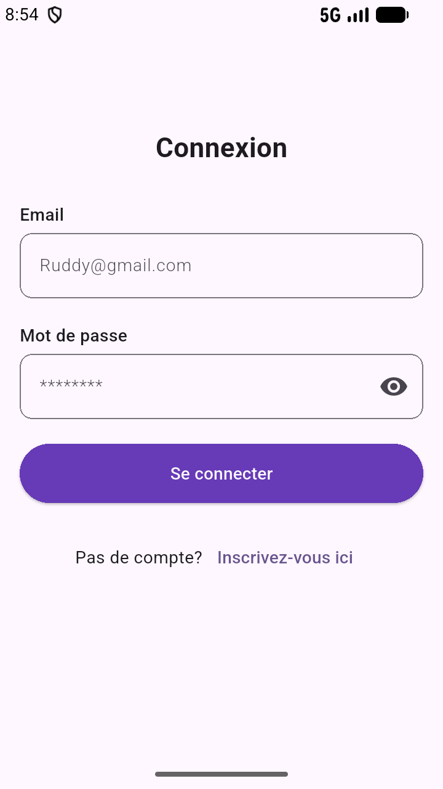
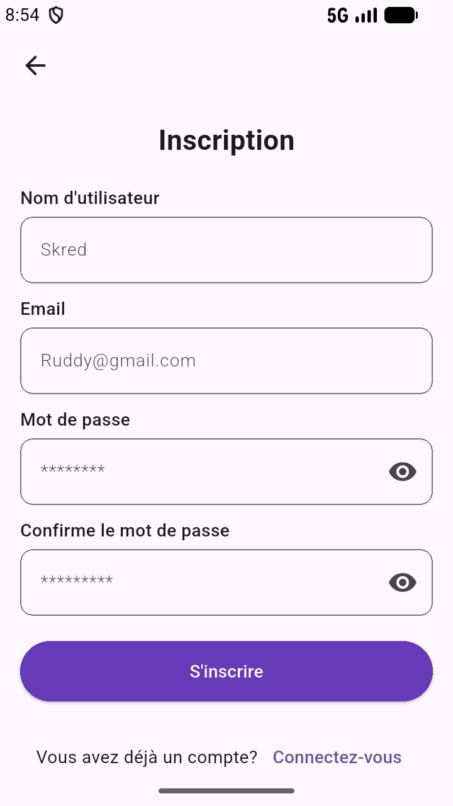
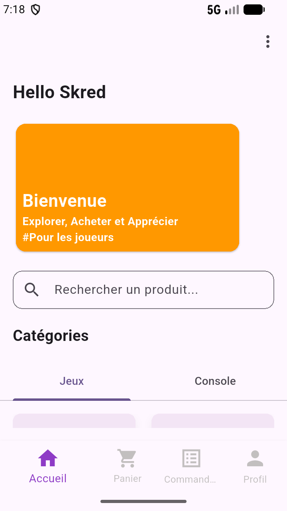
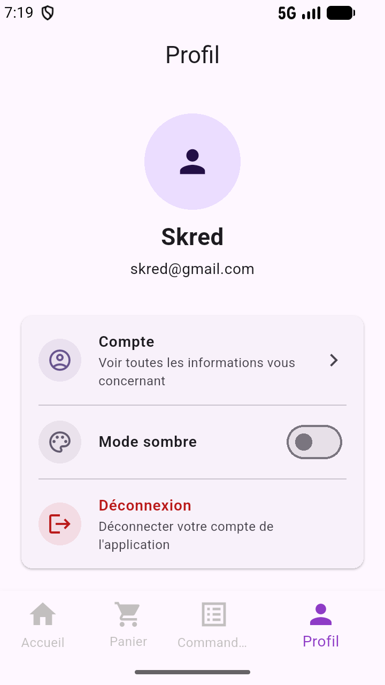
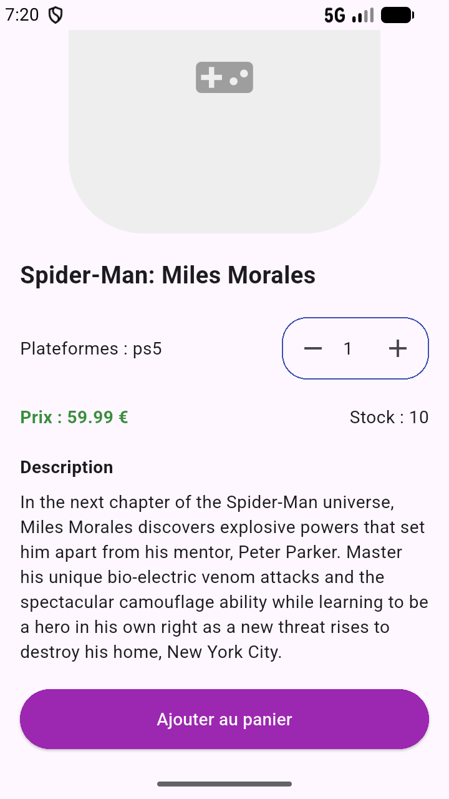
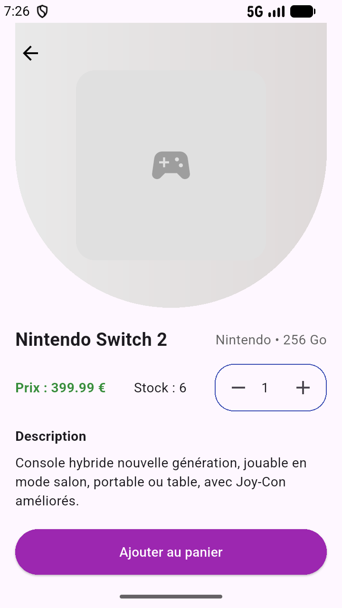
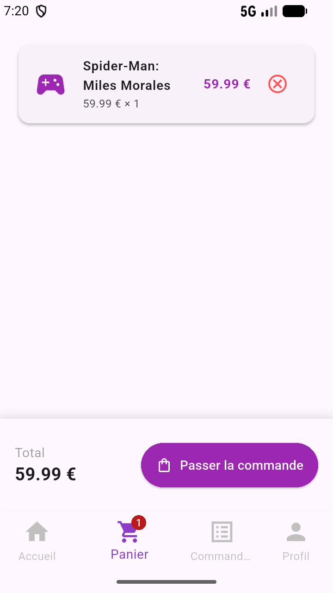
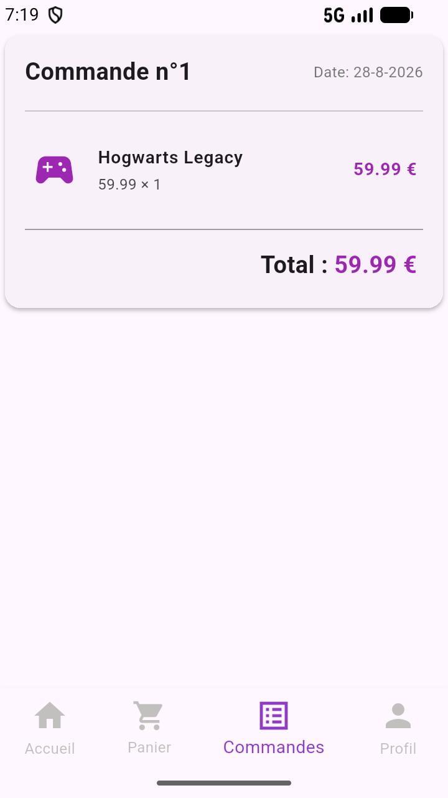

# 🛍️ App E-Commerce - Flutter

Une application mobile & web E-Commerce moderne développée avec **Flutter**, suivant les meilleures pratiques d'architecture (**Feature-First / Clean Architecture**) et utilisant **Riverpod** pour la gestion d'état réactive et asynchrone.

---

## 📸 Aperçu & Captures d'écran

| Page de Connexion | Page d'Inscription | Page d'Accueil | Page Profil |
| :---: | :---: | :---: | :---: |
|  |  |  |  |

| Détails Jeu | Détails Console | Panier d'Achat | Historique Commandes |
| :---: | :---: | :---: | :---: |
|  |  |  |  |

---

## ✨ Fonctionnalités

### 🔐 Authentification & Gestion des Utilisateurs
- **Connexion (`LoginScreen`)** : Validation en temps réel de l'email et du mot de passe avec gestion des erreurs et messages de confirmation (SnackBar).
- **Inscription (`SignupScreen`)** : Formulaire complet avec validation de correspondance des mots de passe.
- **Gestion de Session** : Suivi du statut utilisateur réactif via `authControllerProvider` utilisant `AsyncValue.guard`.

### 🎮 Catalogue de Produits (Jeux & Consoles)
- **Modélisation Polymorphe** : Modèle de base `Product` étendu par les sous-classes métier `Game` et `Console`.
- **Pages de Détails** : `SpecificGameScreen` et `SpecificConsoleScreen` avec sélection dynamique de la quantité et ajout direct au panier.
- **Cartes Produit Responsive** : Composant `CardProduct` optimisé avec affichage des prix, images, cartes adaptatives et bouton réactif de favoris.

### 🔍 Tri & Filtrage Avancés (`product_providers.dart`)
- **Recherche en Temps Réel** : Barre de recherche intuitive permettant de filtrer les produits par nom à la volée via `productSearchProvider`.
- **Tri Dynamique** : Menu déroulant (PopupMenu) permettant de trier la liste par :
  - Nom (croissant `A-Z` et décroissant `Z-A`)
  - Prix (croissant `min -> max` et décroissant `max -> min`)
- **Combinaison Filtre + Tri** : Application croisée et fluide du filtrage puis du tri avant le rendu de la grille via `filteredSortedGamesProvider` et `filteredSortedConsolesProvider`.

### ❤️ Système de Favoris avec Persistance Locale (`favorites`)
- **Marquage Instantané** : Icône cœur réactive sur les cartes et les pages de détails.
- **Écran Dédié (`FavoritesScreen`)** : Liste des favoris avec badge dans la barre de navigation.
- **Persistance Locale (`favorites.json`)** : Sauvegarde et restauration automatique des favoris sur l'appareil via `FavoritesRepository`.

### 🛒 Panier d'Achat & Passation de Commandes
- **Gestion du Panier (`shopping_cart`)** : Ajout d'articles, modification interactive des quantités, suppression et calcul dynamique du total.
- **Gestion des Commandes (`order`)** : Historique et suivi des commandes passées avec gestion des articles commandés (`OrderModel`, `OrderItemModel`).

### 👤 Profil & Personnalisation
- **Gestion du Profil (`ProfileScreen`)** : Affichage des informations de l'utilisateur connecté avec une interface totalement responsive.
- **Thème Sombre / Clair (`ThemeProvider`)** : Prise en charge dynamique du changement de thème de l'application via `themeControllerProvider`.
- **Page À Propos (`AboutScreen`)** : Informations sur l'application et l'équipe.

---

## ⚡ Gestion de l'État & Inventaire des Providers (Riverpod)

L'application utilise **Riverpod** de manière exclusive pour la gestion de l'état UI, des données asynchrones et des services métier.

### 📜 Liste des Providers Utilisés (12 Providers)

| Nom du Provider | Type Riverpod | Rôle & Responsabilité |
| :--- | :--- | :--- |
| `authControllerProvider` | `AsyncNotifierProvider` | Gestion réactive de la session utilisateur, connexion et inscription. |
| `authDataRepositoryProvider` | `Provider` | Instance du repository d'authentification (`AuthDataRepository`). |
| `gamesProvider` | `FutureProvider<List<Game>>` | Chargement asynchrone des jeux depuis le fichier JSON/Repository. |
| `consolesProvider` | `FutureProvider<List<Console>>` | Chargement asynchrone des consoles depuis le fichier JSON/Repository. |
| `productSearchProvider` | `NotifierProvider<String>` | État réactif de la requête de recherche en cours. |
| `productSortProvider` | `NotifierProvider<String?>` | Option de tri sélectionnée (Nom/Prix). |
| `filteredSortedGamesProvider` | `Provider<AsyncValue<List<Game>>>` | Combinaison réactive des jeux filtrés et triés. |
| `filteredSortedConsolesProvider` | `Provider<AsyncValue<List<Console>>>` | Combinaison réactive des consoles filtrées et triées. |
| `favoritesControllerProvider` | `NotifierProvider<List<Product>>` | Gestion de la liste des favoris avec persistance. |
| `favoritesRepositoryProvider` | `Provider` | Persistance locale JSON (`favorites.json`) des favoris. |
| `shoppingCartControllerProvider` | `NotifierProvider` | Gestion du panier d'achat et calcul du total. |
| `orderControllerProvider` | `AsyncNotifierProvider` | Historique des commandes passées. |

---

## 🛡️ Gestion des Erreurs & États Asynchrones (`AsyncValue`)

Pour garantir une expérience utilisateur fluide et sans plantage, l'application applique la gestion explicite des états asynchrones de Riverpod :

1. **Pattern `.when()` dans les Screens (`home.dart`)** :
   ```dart
   gamesAsync.when(
     data: (games) => GridView.builder(...),
     loading: () => const CircularProgressIndicator(),
     error: (err, stack) => Text("Erreur : $err"),
   );
   ```
2. **`AsyncValue.guard()` dans les Contrôleurs** :
   Capture automatiquement les exceptions survenues lors d'opérations asynchrones (ex: `login`, `signup`, `addOrder`) et met à jour l'état UI sans interrompre le thread principal.
3. **Exceptions Métier Personnalisées** :
   - `UserAlreadyExistsException` : Levée lors de l'inscription si l'email existe déjà.
   - `InvalidCredentialsException` : Levée lors de la connexion en cas d'identifiants incorrects.

---

## 🏗️ Architecture du Projet

Le projet suit une **architecture basée sur les fonctionnalités (Feature-First)** couplée aux principes de la **Clean Architecture** :

```text
lib/
├── exceptions/             # Exceptions globales de l'application
├── features/
│   ├── auth/               # Module d'authentification (Login, Signup, User)
│   ├── Console/            # Module des Consoles (Modèles, Repositories, Écrans)
│   ├── favorites/          # Module des favoris (Controller, Repository, Écran)
│   ├── games/              # Module des Jeux vidéo (Modèles, Repositories, Écrans)
│   ├── order/              # Module de gestion des commandes et historique
│   ├── products/           # Module transverse des produits
│   │   ├── application/    # Services de tri (sort_services) et filtrage (filter_services)
│   │   ├── domain/         # Modèle abstrait Product
│   │   └── presentation/   # Providers (product_providers) & Widgets (CardProduct)
│   ├── profile/            # Module de profil utilisateur & page À Propos
│   └── shopping_cart/      # Module du panier d'achat et contrôleurs Riverpod
├── routing/                # Configuration centralisée des routes (GoRouter)
├── shared/                 # Composants et services partagés
│   ├── constants/          # Constantes de l'application
│   ├── models/             # Modèles d'utilisateurs partagés
│   ├── screens/            # Écran d'accueil principal (Home)
│   ├── services/           # Repository générique JSON et ThemeProvider
│   ├── utils/              # Utilitaires de réactivité (responsive.dart)
│   └── widgets/            # Navbar et widgets partagés
└── main.dart               # Point d'entrée de l'application
```

---

## 🧪 Tests Automatisés & Pipeline CI/CD

### 1. Tests Automatisés (`test/`)

Le projet inclut une couverture de tests unitaires et de widgets :
- **Tests Unitaires Services (`test/application/sort_filter_test.dart`)** : Validation des algorithmes de tri (Nom, Prix) et du moteur de recherche.
- **Tests Unitaires Contrôleurs (`test/controllers/favorites_controller_test.dart`)** : Validation de l'état réactif des favoris.
- **Tests Unitaires Modèles (`test/models/product_model_test.dart`)** : Validation des méthodes `fromJson` et `toJson` de `Game` et `Console`.
- **Tests de Widgets (`test/widgets/card_product_test.dart`)** : Validation du rendu du composant `CardProduct` et de son bouton favori.

Pour lancer les tests :
```bash
flutter test
```

### 2. Intégration Continue (CI/CD GitHub Actions)

Un workflow automatisé est configuré dans `.github/workflows/flutter_ci.yml` :
- Exécution automatique à chaque `push` et `pull_request` sur `main`, `develop` et `feature/*`.
- Étapes automatisées : Installation du SDK Flutter, `flutter pub get`, `flutter analyze` et `flutter test`.

---

## 🛠️ Technologies & Packages Utilisés

- **[Flutter](https://flutter.dev/)** - Framework UI multiplateforme
- **[Flutter Riverpod](https://riverpod.dev/)** (`^3.3.2`) - Gestion d'état et injection de dépendances
- **[GoRouter](https://pub.dev/packages/go_router)** (`^17.5.0`) - Routage déclaratif officiel
- **[Cached Network Image](https://pub.dev/packages/cached_network_image)** (`^3.4.1`) - Chargement et mise en cache des images
- **[HTTP](https://pub.dev/packages/http)** (`^1.6.0`) - Requêtes HTTP pour la communication API
- **[Path Provider](https://pub.dev/packages/path_provider)** (`^2.1.6`) - Accès au système de fichiers local pour la persistance JSON

---

## 🚀 Installation et Lancement

### Prérequis
- [Flutter SDK](https://docs.flutter.dev/get-started/install) (version `>= 3.10.8`)
- [Dart SDK](https://dart.dev/get-dart)
- Android Studio / VS Code avec le plugin Flutter

### Étapes d'installation

1. **Cloner le dépôt** :
   ```bash
   git clone https://github.com/Don-SKRED/app-e-commerce.git
   cd app_e_commerce
   ```

2. **Installer les dépendances** :
   ```bash
   flutter pub get
   ```

3. **Lancer les tests** :
   ```bash
   flutter test
   ```

4. **Lancer l'application** :
   ```bash
   flutter run
   ```

---

## 📝 Licence

Ce projet est sous licence libre.
